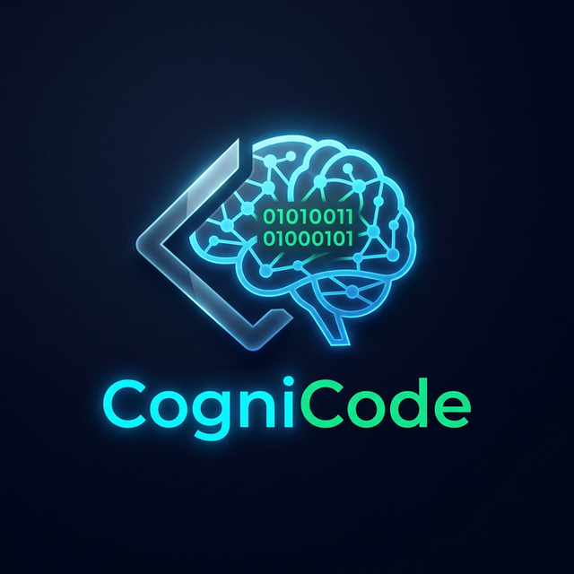
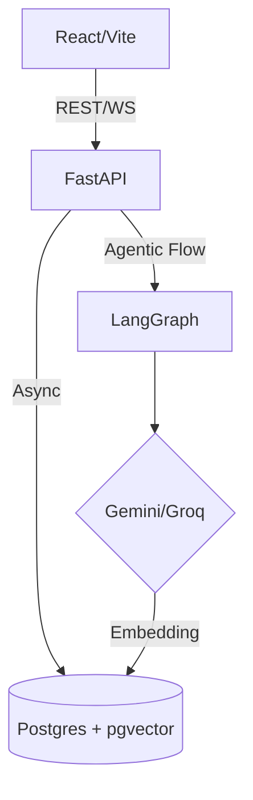

# 🧬 CogniCode — Decode Any Repo in Minutes

**CogniCode** is an AI-powered autonomous educational tool designed to help developers and students understand complex GitHub repositories instantly. It distills bloated source code into **Logical Skeletons** — stripping away boilerplate, imports, and trivialities to expose the core algorithms and design patterns.



## 🚀 Key Features

*   🧬 **Logical Skeletons** — AI-generated simplified code that preserves the "soul" of the logic.
*   📓 **Learning Notebooks** — Every file gets a persistent notebook with:
    *   **File Context**: How it fits into the overall architecture.
    *   **Removal Log**: What was stripped (and why) to create the skeleton.
    *   **Skeleton Analysis**: Deep-dive into specific algorithms.
*   🤖 **AI Tutor Chat** — Context-aware, 5-layer secured chat with persistent Q&A history.
*   ✂️ **Dual Monaco Editor** — Side-by-side view: Original Source (Read-only) vs. Logical Skeleton.
*   📊 **Project Overview** — Auto-detected tech stack, language distribution, and project-level synthesis.
*   ⚡ **Semantic Cache** — Optimized SQL vector search via `pgvector` to avoid redundant LLM calls.
*   🛡️ **5-Layer Security** — Shielded input, AST stripping, and sandbox hooks for safe analysis.

## 🛠️ Tech Stack

| Layer | Technology |
| :--- | :--- |
| **Frontend** | React, Vite, Tailwind CSS, Framer Motion, Monaco Editor, Zustand |
| **Backend** | FastAPI (Async), SQLAlchemy, LangGraph (Agentic Chat), Pydantic |
| **Database** | SQLite (Dev) / **PostgreSQL + pgvector** (Production) |
| **Models** | Gemini 2.5 Pro/Flash, Groq (Llama 3.3, Qwen3) |
| **Vector DB** | Native `pgvector` integration for SQL similarity search |

## 🏁 Quick Start

### 1. Prerequisite API Keys
You will need:
*   [Google AI Studio](https://aistudio.google.com/) (Gemini API Key)
*   [Groq Console](https://console.groq.com/) (Groq API Key)
*   [GitHub PAT](https://github.com/settings/tokens) (Personal Access Token)

### 2. Environment Configuration
```bash
# Inside the root directory
cp backend/.env.example backend/.env
# Update .env with your keys
```

### 3. Running the Backend
```bash
cd backend
python -m venv venv
# Windows:
venv\Scripts\activate
# Linux/Mac:
source venv/bin/activate

pip install -r requirements.txt
uvicorn app.main:app --reload --port 8000
```

### 4. Running the Frontend
```bash
cd frontend
npm install
npm run dev
```

## 🏗️ Architecture Overview

The system follows a **Map-Reduce Analysis Pipeline**:
1.  **Ingestion**: Clones repo → Indexes file tree.
2.  **Mapping**: Individual file analysis (Logical Skeleton + Context generation).
3.  **Reduction**: Project-level synthesis using the results from the Mapping phase.
4.  **Interaction**: Agentic chat using LangGraph for multi-turn stateful persistence.



## 🔐 Security Architecture
CogniCode implements a **5-Layer Shield**:
1.  **Shielded Input**: Validates repo URLs and branch names.
2.  **AST Stripping**: Basic code sanitization before sending to LLM.
3.  **Sentinel Validation**: Logic checks for malicious patterns during generation.
4.  **Sandbox Hooks**: Simulated execution environments for analysis.
5.  **Human-in-the-Loop**: Transparent logs for all AI decisions.

## 📜 License
MIT
